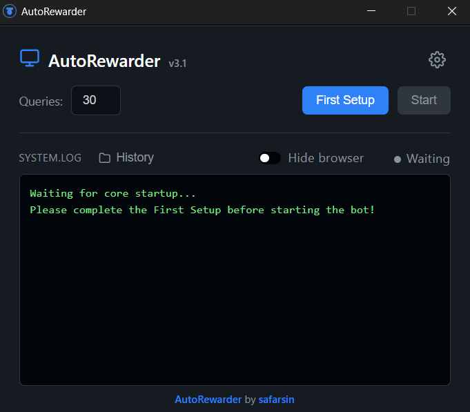
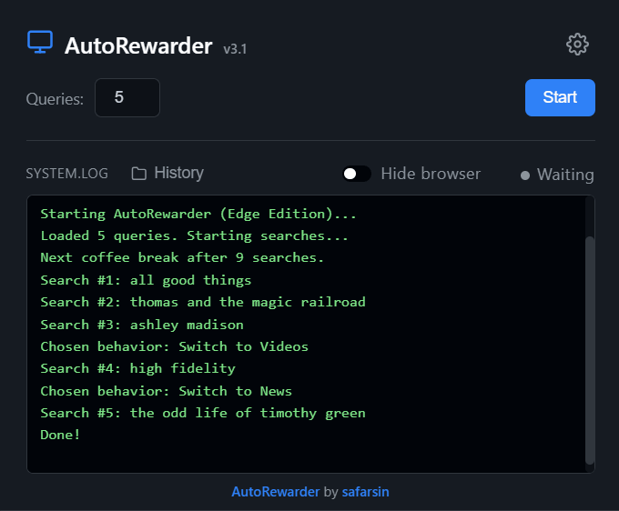
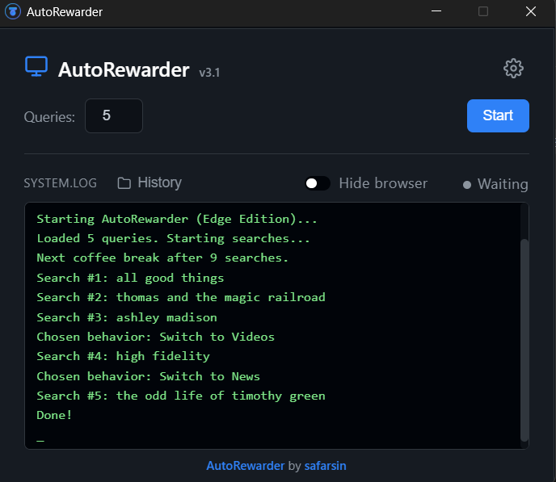

# AutoRewarder


An advanced, set-and-forget automation tool for Microsoft Rewards. AutoRewarder performs Bing searches and collects Daily Sets using mathematically driven, human-like input simulation (W3C Actions, Bezier curves, and smart scrolling).

Built with a robust Python/Selenium backend, it offers two modes of operation: a sleek HTML/CSS/JS frontend wrapped in a native window via pywebview, and a script-only version (CLI tool) for running without GUI. Packaged as an executable Windows app (via Inno Setup) for a seamless, plug-and-play experience.

> **Ready to start? Check out the complete [USER GUIDE](USER_GUIDE.md)**

---

## Table of Contents

- [Installation](#installation)
- [Screenshots & Demo](#screenshots--demo)
- [Tech Stack](#tech-stack)
- [System Requirements](#system-requirements)
- [Features](#features)
- [Quick Start (For Users)](#quick-start-for-users)
- [Development Setup (For Developers)](#development-setup-for-developers)
- [CLI Usage](#cli-usage)
- [Build & Distribution](#build--distribution)
- [Project Structure](#project-structure)
- [Runtime Data](#runtime-data)
- [Troubleshooting](#troubleshooting)
- [Roadmap](#roadmap)

---

## Installation

**Easy Way (Recommended):**
Download `AutoRewarder-Setup.exe` from the [latest release](https://github.com/safarsin/AutoRewarder/releases/latest) and run it. The installer will verify all dependencies and install the app for you.

**Portable Way:**
Download `AutoRewarder.zip` from the [latest release](https://github.com/safarsin/AutoRewarder/releases/latest) and extract it to any folder (e.g., a USB drive). Run the executable. All your settings and profiles will be saved locally inside the `config` folder.
> **Note:** Because the portable version is a single-file build, it may take a few seconds longer to start up compared to the installed version while it unpacks core components. Once open, it works at full speed.

**Manual Way (Source):**
Clone this repo, create virtual environment, and run `python AutoRewarder.py`.

---

## Screenshots & Demo

| Perform Searches | Driver Preparation |
| :---: | :---: |
|||

|Daily Sets| Tab Switching |
| :---: | :---: |
|||

> <sub>*Demo is sped up for viewing purposes. Actual execution includes randomized delays and pauses to mimic human behavior.*</sub>

| Main Window | Settings & History |
| :---: | :---: |
|  |  |
|  |  |

---

## Tech Stack

| Layer | Technology |
|-------|------------|
| Backend | Python 3.12, [selenium](https://www.selenium.dev/), [pywebview](https://pywebview.flowrl.com/) |
| Frontend | HTML, CSS, JavaScript |
| Bridge | pywebview JS API (pywebview.api) |
| Build | [PyInstaller](https://pyinstaller.org/), [Inno Setup](https://jrsoftware.org/isinfo.php) |

---

## System Requirements

- **OS**: Windows 10 or later (can also work on Linux but it is not downloadable as an executable)
- **Browser**: Microsoft Edge (driver managed by Selenium Manager)
- **.NET Framework**: 4.8 or higher (automatically checked by installer)
- **RAM**: Minimum 512 MB (1 GB recommended)
- **Disk Space**: ~50 MB

---

## Features

**User Experience & Interface:**
- First Setup flow with dedicated Edge profile for isolation
- Comprehensive settings section
- Optional hide-browser mode (headless automation toggle)
- Live terminal-like logs with real-time updates
- Script-only version (CLI tool) for running without GUI
- Update available notifications (GitHub Releases)
- Local history view with date, time, query, and execution status
- One-click start automation (1-99 searches per session)
- Safe recovery for corrupted settings/history files

**Automation & Core Logic:**
- Automatic start-up (launches the app silently in the background on system boot)
- Configurable run pacing (run duration, total searches, and queries-per-hour distribution during a session)
- Background WebDriver warmup at startup for faster execution
- Human-like search behavior (typing delays, random pauses, smooth scrolling)
- Uses real-world queries from assets/queries.json (8154 unique entries from google-trends dataset)
- Randomized delays to reduce repetitive patterns
- Optional tab switching between result categories (Images/Videos/News)
- Natural mouse movement/clicking (W3C Actions)
- Daily Set task collection (runs once per day)
- Separate browser thread isolation

**Developer & Code Quality:**
- Advanced documentation (comprehensive docstrings and detailed guides)
- Strict code formatting and static type checking (Black, Flake8, MyPy) 

---

## Quick Start (For Users)

You do not need Python to use release builds.

1. Download `AutoRewarder-Setup.exe` from the latest release
2. Install and run the app
3. Complete First Setup
4. Start automation

For detailed guide, see [USER_GUIDE.md](USER_GUIDE.md)

---

## Development Setup (For Developers)

1. Clone the repository.
2. Create and activate a virtual environment.
3. Install dependencies.
4. Run the app.

```bash
python -m venv .venv
.\.venv\Scripts\Activate.ps1
pip install -r requirements.txt
python AutoRewarder.py
```
---

## CLI Usage

For users who prefer the terminal or want to integrate the bot into custom scripts, a headless CLI version is available.

### Available CLI Arguments

These arguments can be combined. If you run the script without any arguments (`python AutoRewarder_CLI.py`), it will automatically read your last saved settings from the GUI.

| Argument | Type | Description | Default / Fallback |
| :--- | :--- | :--- | :--- |
| `--once` | Flag | Runs the bot in a single immediate batch. It will perform all queries at once without scheduling. | Uses Advanced Scheduling if it is enabled in your settings. |
| `--count` | Integer | Number of search queries for a single run. (Only used if `--once` is provided). | Reads `totalQueries` from settings (or defaults to 30). |
| `--duration` | Float | Run duration in hours for scheduled mode. The bot will distribute queries into small batches over this time. | Reads `runDuration` from settings (default is 3 hours). |
| `--total-queries` | Integer | Total number of queries to perform during the scheduled `--duration`. | Reads `totalQueries` from settings. |
| `--queries-per-hour` | Integer | Target number of searches per hour. If provided, the script can calculate total queries automatically. | Reads `queriesPerHour` from settings. |

> **Note:** The `headless` mode is **forced permanently** within this CLI script to ensure silent background execution.

---

### Example CLI scheduling commands:

```bash
# One-off run (execute immediately and exit)
python AutoRewarder_CLI.py --once --count 30

# Scheduled distribution: run 30 queries over 3 hours
python AutoRewarder_CLI.py --duration 3 --total-queries 30

# Use saved GUI settings (no args)
python AutoRewarder_CLI.py
```

---

## Build & Distribution

**Build EXE (for installer creation):**
```bash
.\.venv\Scripts\python.exe -m PyInstaller --noconfirm --clean AutoRewarder.spec
```

**Create Windows Installer:**
```bash
"C:\Program Files (x86)\Inno Setup 6\iscc.exe" AutoRewarder.iss
```
Or use the Inno Setup IDE to open `AutoRewarder.iss` and compile it.
Output: `dist/AutoRewarder-Setup.exe`

---

## Project Structure

```text
AutoRewarder/
├── GUI/
│   ├── index.html        # Main window UI
│   ├── history.html      # History view UI
│   ├── history.css       # History view styling
│   ├── script.js         # Frontend logic and bridge calls
│   ├── styles.css        # App styling
│   ├── settings.js       # Settings page logic and bridge calls
│   ├── settings.css      # Settings page styling
│   └── normalize.css     # CSS reset
├── assets/
│   ├── icon.ico          # App icon
│   ├── queries.json      # Queries list (8154 unique queries)
│   └── screenshots/      # Screenshots and GIFs for documentation
├── src/
│   ├── __init__.py       # Python package initialization
│   ├── api.py            # Centralizes all main operations (bridge API exposed to JS)        
│   ├── config.py         # Configuration constants/platform and file paths
│   ├── daily_set.py      # Rewards Daily Set collection logic
│   ├── driver_manager.py # WebDriver setup and management
│   ├── history.py        # Manages search history storage and retrieval
│   ├── human_behavior.py # Human-like mouse movement/clicks/scrolling
│   ├── search_engine.py  # Handles search logic and interactions
│   ├── settings_manager.py # Manages user settings storage and retrieval
│   └── utils.py          # Utility functions(human-typing, update checks)
├── AutoRewarder.py       # Python backend and webview window
├── AutoRewarder_CLI.py   # Script-only version without GUI (for advanced users)
├── AutoRewarder.spec     # PyInstaller build spec
├── AutoRewarder.iss      # Inno Setup installer script
├── LICENSE              
├── README.md 
├── USER_GUIDE.md          
└── requirements.txt      
```

---

## Runtime Data

The application stores its runtime files (profiles, history, logs, and settings) in a dedicated folder separate from your main browser. 

**On Windows:**
```text
%USERPROFILE%\AppData\Local\AutoRewarder
```

**On Linux:**
```text
~/.local/share/AutoRewarder
```

Created files and folders:
```text
EdgeProfile/   # Separate Edge profile for WebDriver
settings.json  # User settings (first_setup_done, hide_browser)
history.json   # Search history (date, time, query, status)
status.json    # Daily Set completion status (per-day)
background_log.txt # Logs from the background performance (for debugging)
```

---

## Troubleshooting

For common issues and solutions, see the [Troubleshooting](USER_GUIDE.md#troubleshooting) section in the USER GUIDE.

---

## Roadmap

- [x] Windows installer with dependency checking (Inno Setup)
- [x] Action Chains Selenium/W3C Actions for more natural mouse movement and clicks
- [x] Daily Set collector
- [x] Refactor: split monolith to src modules
- [x] Update checks (GitHub Releases API)
- [x] Better randomized scrolling (unique speed/length per session)
- [x] Advanced "coffee" breaks during long sessions
- [x] Navigation flow: sometimes switch result tabs (Images/Videos/News)
- [x] Script-only version (CLI tool without GUI)
- [x] Automatic start-up 
- [x] Query pacing over a specified duration (rate-based scheduling)
- [ ] Statistics dashboard (points tracking, session summaries)
- [ ] Browser choice (Chrome, Firefox support in addition to Edge)
- [ ] Multi-account support (manage multiple Rewards accounts)
- [ ] Mobile support
- [ ] Daily "Claim" actions
- [ ] Keyboard shortcuts
- [ ] UI themes (dark/light mode)

---

## Disclaimer

Using automation against third-party services may violate their Terms of Service.
You are responsible for your own usage.

---

## Contact

Open an issue for bugs, ideas, or questions.

---

## Support

If you found this project helpful and would like to support my work, you can buy me a coffee here:

[](https://www.buymeacoffee.com/safarsin)
