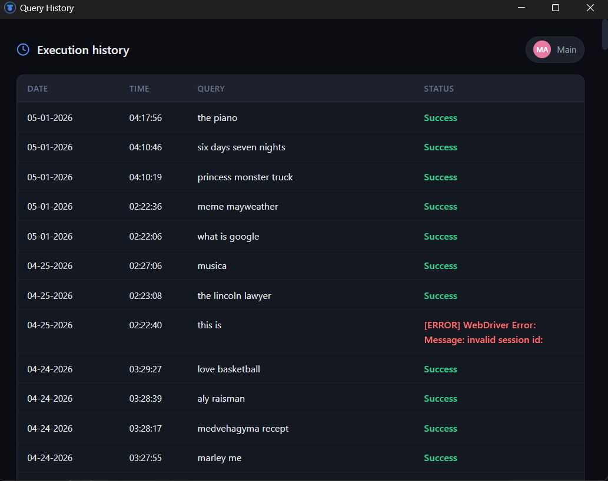

# AutoRewarder

An advanced desktop automation tool for Microsoft Rewards. AutoRewarder performs Bing searches and collects Daily Sets using mathematically driven, human-like input simulation (W3C Actions, Bezier curves, and smart scrolling).

Built with a robust Python/Selenium backend and a sleek HTML/CSS/JS frontend wrapped in a native window via pywebview. Packaged as a standalone Windows executable (via Inno Setup) for a seamless, plug-and-play experience.

> **Ready to start? Check out the complete [USER GUIDE](USER_GUIDE.md)**

## Installation

**Easy Way (Recommended):**
Download `AutoRewarder-Setup.exe` from the [latest release](https://github.com/safarsin/AutoRewarder/releases/latest) and run it. The installer will verify all dependencies and install the app for you.

**Manual Way (Source):**
Clone this repo, create virtual environment, and run `python AutoRewarder.py`.

<br>

## What's New in v3.0

- Refactor: split the original monolith into `src/` modules
- Update checks: auto-notification when a new version is available
- Better randomized scrolling: unique scrolling speed/length per session
- Advanced "coffee" breaks during long sessions
- Navigation flow: occasionally switches result tabs (Images/Videos/News)
- New mouse interaction: more natural pointer movement/clicks
- Daily Set collector: completes Rewards Daily Set tasks once per day

## Screenshots

| Perform Searches | Driver Preparation |
| :---: | :---: |
|||

| Main Window | History Window |
| :---: | :---: |
|  |  |
|  |  |

## Tech Stack

| Layer | Technology |
|-------|------------|
| Backend | Python 3.12, [selenium](https://www.selenium.dev/), [pywebview](https://pywebview.flowrl.com/) |
| Frontend | HTML, CSS, JavaScript |
| Bridge | pywebview JS API (pywebview.api) |
| Build | [PyInstaller](https://pyinstaller.org/), [Inno Setup](https://jrsoftware.org/isinfo.php) |

## System Requirements

- **OS**: Windows 10 or later (can also work on Linux but it is not downloadable as an executable)
- **Browser**: Microsoft Edge (driver managed by Selenium Manager)
- **.NET Framework**: 4.8 or higher (automatically checked by installer)
- **RAM**: Minimum 512 MB (1 GB recommended)
- **Disk Space**: ~50 MB

## Features

**User Features:**
- First Setup flow with dedicated Edge profile for isolation
- Optional hide-browser mode (headless automation toggle)
- Live terminal-like logs with real-time updates
- Update available notifications (GitHub Releases)
- Local history view with date, time, query, and execution status
- One-click start automation (1-99 searches per session)
- Safe recovery for corrupted settings/history files

**Automation Features:**
- Background WebDriver warmup at startup for faster execution
- Human-like search behavior (typing delays, random pauses, smooth scrolling)
- Uses real-world queries from assets/queries.json (3428 unique entries from google-trends dataset)
- Randomized delays to reduce repetitive patterns
- Optional tab switching between result categories (Images/Videos/News)
- Natural mouse movement/clicking (W3C Actions)
- Daily Set task collection (runs once per day)
- Separate browser thread isolation

## Quick Start (For Users)

You do not need Python to use release builds.

1. Download `AutoRewarder-Setup.exe` from the latest release
2. Install and run the app
3. Complete First Setup
4. Start automation

For detailed guide, see [USER_GUIDE.md](USER_GUIDE.md)

## Development Setup (For Developers)

1. Clone the repository.
2. Create and activate a virtual environment.
3. Install dependencies.
4. Run the app.

```bash
python -m venv .venv
.\.venv\Scripts\Activate.ps1
pip install -r requirements.txt
python AutoRewarder.py
```

## Build & Distribution

**Build EXE (for installer creation):**
```bash
.\.venv\Scripts\python.exe -m PyInstaller --noconfirm --clean AutoRewarder.spec
```

**Create Windows Installer:**
```bash
"C:\Program Files (x86)\Inno Setup 6\iscc.exe" AutoRewarder.iss
```
Or use the Inno Setup IDE to open `AutoRewarder.iss` and compile it.
Output: `dist/AutoRewarder-Setup.exe`

## Project Structure

```text
AutoRewarder/
├── GUI/
│   ├── index.html        # Main window UI
│   ├── history.html      # History view UI
│   ├── script.js         # Frontend logic and bridge calls
│   ├── styles.css        # App styling
│   └── normalize.css     # CSS reset
├── assets/
│   ├── icon.ico          # App icon
│   ├── queries.json      # Queries list (3428 unique queries)
│   └── screenshots/      # Screenshots and GIFs for documentation
├── src/
│   ├── __init__.py       # Python package initialization
│   ├── api.py            # Centralizes all main operations (bridge API exposed to JS)        
│   ├── config.py         # Configuration constants/platform and file paths
│   ├── daily_set.py      # Rewards Daily Set collection logic
│   ├── driver_manager.py # WebDriver setup and management
│   ├── history.py        # Manages search history storage and retrieval
│   ├── human_behavior.py # Human-like mouse movement/clicks/scrolling
│   ├── search_engine.py  # Handles search logic and interactions
│   ├── settings_manager.py # Manages user settings storage and retrieval
│   └── utils.py          # Utility functions(human-typing, update checks)
│ 
├── AutoRewarder.py       # Python backend and webview window
├── AutoRewarder.spec     # PyInstaller build spec
├── AutoRewarder.iss      # Inno Setup installer script
├── LICENSE              
├── README.md            
└── requirements.txt      
```

## Runtime Data

The app stores runtime files in:

```text
%USERPROFILE%\AppData\Local\AutoRewarder
```

Created files and folders:
```text
EdgeProfile/   # Separate Edge profile for WebDriver
settings.json  # User settings (first_setup_done, hide_browser)
history.json   # Search history (date, time, query, status)
status.json    # Daily Set completion status (per-day)
```


## Troubleshooting

**Edge WebDriver not found or outdated:**
- Ensure Microsoft Edge is installed
- Try restarting the application (Selenium Manager will auto-download driver)
- Check that Edge version is up to date
- Delete `%USERPROFILE%\AppData\Local\AutoRewarder\EdgeProfile` and retry

**`session not created: DevToolsActivePort file doesn't exist` / Edge failed to start:**
- Close AutoRewarder and any Edge windows
- Open Windows Task Manager and kill all `msedge.exe` processes (and `msedgedriver.exe` if present)
- Open Edge normally and complete any pending updates at `edge://settings/help`
- Re-run AutoRewarder
- If it still fails, delete `%USERPROFILE%\AppData\Local\AutoRewarder\EdgeProfile` and run First Setup again

**Application crashes on startup:**
- Delete `EdgeProfile/` folder in `%USERPROFILE%\AppData\Local\AutoRewarder`
- Run First Setup again
- Verify dependencies: `pip install -r requirements.txt` if running from source
- Check Windows Event Viewer for error details

**Searches not completing:**
- Verify internet connection
- Check that Edge is not blocked by antivirus/firewall

## Roadmap

- [ ] Browser choice (Chrome, Firefox support in addition to Edge)
- [ ] Advanced scheduling (automated daily runs at specific times)
- [ ] Statistics dashboard (points tracking, session summaries)
- [ ] Multi-account support (manage multiple Rewards accounts)
- [ ] Script-only version (CLI tool without GUI)
- [x] Windows installer with dependency checking (Inno Setup)
- [ ] Action Chains Selenium
- [x] Daily Set collector
- [ ] Daily Set "Claim" actions
- [ ] Keyboard shortcuts
- [ ] UI themes (dark/light mode)

## Disclaimer

Using automation against third-party services may violate their Terms of Service.
You are responsible for your own usage.

## Contact

Open an issue for bugs, ideas, or questions.

## Support

If you found this project helpful and would like to support my work, you can buy me a coffee here:

[](https://www.buymeacoffee.com/safarsin)